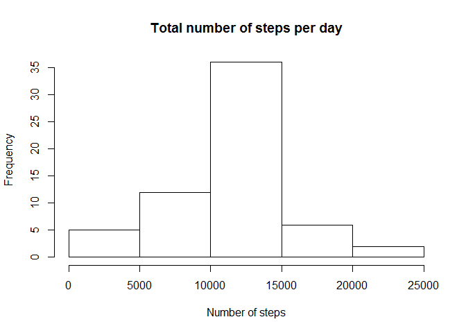

# Peer Assignment 1
Viswanth  
Saturday, July 19, 2014  

This is an R Markdown document for the first Peer Assignment.

First load the activity data into a data frame and have a glimpse into the data with the help of summary functon. 


```r
act_data <- read.csv("C:/R_working_dir/data/activity.csv")
summary(act_data)
```

```
##      steps               date          interval   
##  Min.   :  0.0   2012-10-01:  288   Min.   :   0  
##  1st Qu.:  0.0   2012-10-02:  288   1st Qu.: 589  
##  Median :  0.0   2012-10-03:  288   Median :1178  
##  Mean   : 37.4   2012-10-04:  288   Mean   :1178  
##  3rd Qu.: 12.0   2012-10-05:  288   3rd Qu.:1766  
##  Max.   :806.0   2012-10-06:  288   Max.   :2355  
##  NA's   :2304    (Other)   :15840
```

Since there are missing values I will replace those with the mean values for that particular interval range and recreate the dataset.


```r
library(plyr)
```

```
## Warning: package 'plyr' was built under R version 3.1.1
```

```r
int_mean <- function(x) replace(x, is.na(x), mean(x, na.rm = TRUE))
new_act_data <-  plyr::ddply(act_data[1:3], .(interval),transform, steps = int_mean(steps),date = date,interval=interval) 
```

Now get the count of steps for each day

```r
countSteps <- aggregate(steps ~ date, new_act_data, sum)
```

Generate the histogram of the number of steps per day.

```r
hist(countSteps$steps, main = "Total number of steps per day", xlab="Number of steps")
```

 

Calculating the mean and median of the data

```r
mean(countSteps$steps)
```

```
## [1] 10766
```

```r
median(countSteps$steps)
```

```
## [1] 10766
```
