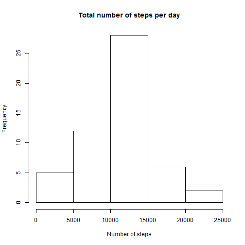

## Loading and preprocessing the data

First load the activity data into a data frame and have a glimpse into the data with the help of summary functon. 

PS: Assuming that the activity.csv folder is in the working directory


```r
act_data <- read.csv("activity.csv")
summary(act_data)
```

```
##      steps               date          interval   
##  Min.   :  0.0   2012-10-01:  288   Min.   :   0  
##  1st Qu.:  0.0   2012-10-02:  288   1st Qu.: 589  
##  Median :  0.0   2012-10-03:  288   Median :1178  
##  Mean   : 37.4   2012-10-04:  288   Mean   :1178  
##  3rd Qu.: 12.0   2012-10-05:  288   3rd Qu.:1766  
##  Max.   :806.0   2012-10-06:  288   Max.   :2355  
##  NA's   :2304    (Other)   :15840
```

The dataset provided seems to be good and needs no further processing for now. 

## What is mean total number of steps taken per day?

Get the count of steps for each day. This is done with the help of aggregate function which aggregates the steps factored by dates and applies the function sum to the factored data.


```r
countSteps_na <- aggregate(steps ~ date, act_data, sum)
```

Generate the histogram of the number of steps per day using the hist function. 


```r
hist(countSteps_na$steps, main = "Total number of steps per day", xlab="Number of steps")
```

 

Calculating the mean and median of the data. This is simply done using the mean and median functions.


```r
mean(countSteps_na$steps)
```

```
## [1] 10766
```

```r
median(countSteps_na$steps)
```

```
## [1] 10765
```


## What is the average daily activity pattern?

Get the total steps per interval across all days using the aggregate function and then plot the graph for average number of steps per interval averaged across all days. We use the aggregate function with the sum method again to get the number of steps in each interval. We plot the interval against the steps. We divide the steps by 61 as we want the average of steps over 61 days.


```r
steps_per_interval <- aggregate(steps~interval,act_data,sum)
plot(steps_per_interval$interval,steps_per_interval$steps/61,xlab="Intervals",ylab="Average Steps", type="l")
```

 

Get the interval with the maximum number of steps on average.We us the which.max function to extract the maximum value


```r
steps_per_interval$interval[which.max(steps_per_interval$steps)]
```

```
## [1] 835
```

## Imputing missing values

Since there are missing values, replace those with the mean values for that particular interval range and recreate the dataset. The plyr library supplies us with the necessary functions to do this task.


```r
library(plyr)
int_mean <- function(x) replace(x, is.na(x), mean(x, na.rm = TRUE))
new_act_data <-  plyr::ddply(act_data[1:3], .(interval),transform, steps = int_mean(steps),date = date,interval=interval) 
```

Now get the count of steps for each day with the imputed data

```r
countSteps <- aggregate(steps ~ date, new_act_data, sum)
```

Generate the histogram of the number of steps per day.

```r
hist(countSteps$steps, main = "Total number of steps per day", xlab="Number of steps")
```

 

Calculating the mean and median of the data

```r
mean(countSteps$steps)
```

```
## [1] 10766
```

```r
median(countSteps$steps)
```

```
## [1] 10766
```

We observe that the mean of the data is same in both the cases. This is expected we are using the mean to fill in the missing values. 

## Are there differences in activity patterns between weekdays and weekends?

Get the weekdays from the data and merge it with the existing data,adding a new column representing the day of the date.

```r
weekdays <- weekdays(as.Date(new_act_data$date))
data_weekdays <- transform(new_act_data, day=weekdays)
```

Add a new column indicating if it is a weekday or weekend


```r
data_weekdays$wk <- ifelse(data_weekdays$day %in% c("Saturday", "Sunday"),"weekend", "weekday")
```

Average the data according to weekday or weekend

```r
average_week <- ddply(data_weekdays, .(interval, wk), summarise, steps=mean(steps))
```

Import lattice library and plot the graph.

```r
library(lattice)
xyplot(steps ~ interval | wk, data = average_week, layout = c(1, 2), ylab = "Number of Steps", xlab = "Interval", type="l")
```

 


```r
library(knitr)
knit2html("PA1_template.Rmd")
```

```
## 
## 
## processing file: PA1_template.Rmd
```

```
## Error: duplicate label 'loadData'
```

